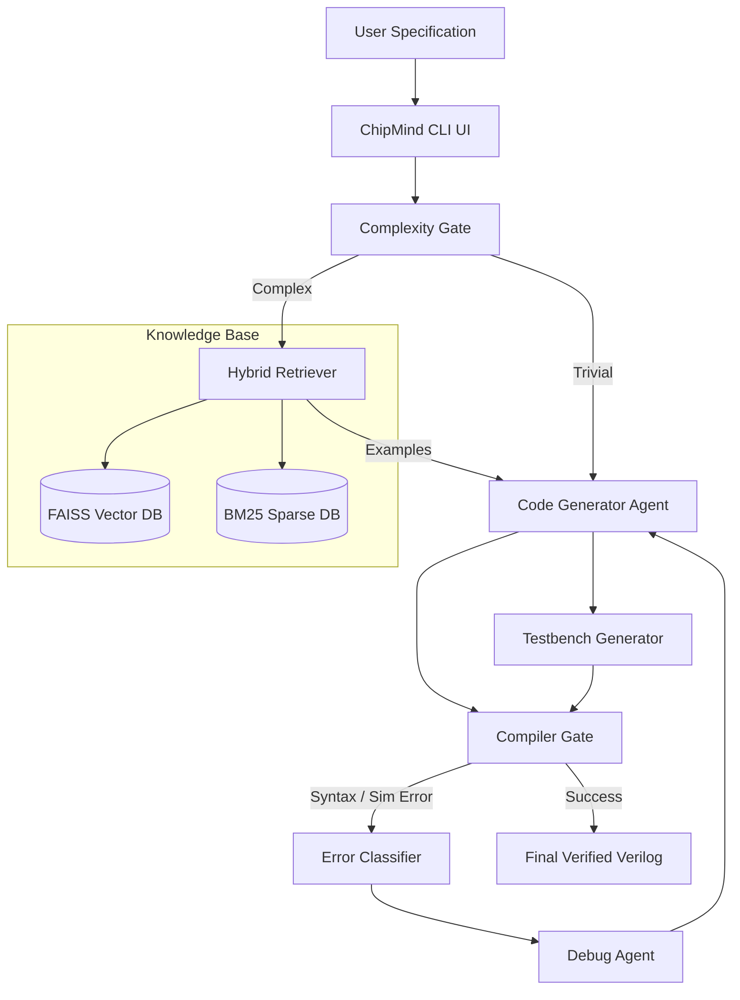

# 🧠 ChipMind: Multi-Agent RTL Design Assistant


**ChipMind** is an advanced, terminal-based AI hardware design assistant. By combining large language models (LLMs) with Retrieval-Augmented Generation (RAG) and deterministic physical compilers (like Icarus Verilog), ChipMind autonomously generates, tests, and debugs complex synthesizable Verilog modules directly from natural language specifications.

It is designed to feel like a high-end CLI tool (such as `Claude Code` or the `GitHub CLI`), bringing professional RTL generation to your terminal.

## Benchmark Results (VerilogEval-Human)

We evaluated ChipMind against the standard **VerilogEval-Human** benchmark (156 problems) to accurately measure the impact of multi-agent debug loops compared to zero-shot generation. 

*Evaluated using `meta/llama-3.3-70b-instruct` via NVIDIA NIM.*

| Mode | Pass@1 Accuracy | Syntax Rate | Avg Iterations |
| :--- | :--- | :--- | :--- |
| **Zero-Shot Baseline** | 51% | 86% | N/A |
| **RAG-Only Baseline** | 47% | 89% | N/A |
| **ChipMind (Agentic Loop)** | **59%** | **96%** | 2 |

### The Power of Agentic Compilation
While RAG alone struggles with zero-shot accuracy due to context over-complication (-4% Pass Rate vs Baseline), the **Agentic Debug Loop** completely transforms the output. 

By grounding the LLM with deterministic physical validation (Icarus Verilog), ChipMind's autonomous debugging achieves a **+10% absolute boost in Syntax Verification** and an **+8% boost in functional Pass@1 capacity**, autonomously repairing 1 in 10 broken scripts that zero-shot LLMs would conventionally fail on.

---

## Architecture

ChipMind relies on a decoupled, multi-modal semantic pipeline combining local static analysis with distributed API reasoning.



---

## How It Works (The 6-Step Autonomy Loop)

1. **Spec Extraction**: An LLM parses the user's human-language query into a rigid JSON specification (ports, constraints, complexity hints).
2. **Hybrid RAG**: For complex components, a hybrid engine retrieves historically successful Verilog modules using both dense semantics (MiniLM) and exact-keyword matching (BM25).
3. **Draft Generation**: The primary Design Agent writes the first draft of the RTL, strictly bounded by the JSON constraints and contextual RAG clues.
4. **Testbench Scaffolding**: A secondary Test Agent writes a synthetic Verilog testbench targeting edge cases described in the spec.
5. **Deterministic Compilation**: Both files are violently evaluated in a sandbox against Icarus Verilog (`iverilog` & `vvp`).
6. **Agentic Debugging**: If compilation or simulation fails, the Error Classifier extracts the failure traces and feeds them back to the Debug Agent, looping up to 5 times until the code mathematically passes simulation constraints.

---

## Tech Stack

| Component | Technology | Description |
| :--- | :--- | :--- |
| **Core UI** | `rich`, `prompt_toolkit` | High fidelity terminal interfaces |
| **LLM Inference** | `openai` (NIM), `groq` | Vendor-agnostic LLM client routing |
| **Retrieval (Dense)** | `sentence-transformers`, `faiss-cpu` | Semantic search over code logic |
| **Retrieval (Sparse)** | `rank-bm25` | Exact-match keyword retrieval |
| **Compilation Sandbox**| `Icarus Verilog (iverilog)` | Local Verilog validation |
| **Orchestration** | `langchain`, `langgraph` | Agentic state-machine workflows |

---

## Quick Start Guide

### Prerequisites
* Python 3.11+
* `Icarus Verilog` (Install via `brew install icarus-verilog` or `apt-get install iverilog`)

### 1. Clone & Setup
```bash
git clone https://github.com/your-username/ChipMind.git
cd ChipMind

# Create environment and install dependencies
python -m venv .venv
source .venv/bin/activate
pip install -e .
```

### 2. Environment Variables
Copy the example environment file and add your keys:
```bash
cp .env.example .env
```
Open `.env` and configure your API keys:
```env
NVIDIA_API_KEY=nvapi-...
GROQ_API_KEY=gsk_...
```

### 3. Build the Knowledge Base (Optional but Recommended)
For complex queries, you stringently need the local RAG database:
```bash
make pipeline
```

### 4. Launch the CLI
```bash
make cli
```

---

## CLI Demo & Usage

Once launched via `make cli`, ChipMind drops you into a beautiful, reactive prompt. 

Just type plain english:
> `chipmind (nvidia/llama) > Build me a parameterized 16-bit CLA adder with carry out.`

### Supported Slash Commands
The UI supports rich text macros dynamically:

* `/help` — Show command reference
* `/retrieve <q>` — Search knowledge base, show RAG hits
* `/compile [file]` — Compile last generated code or local file
* `/save [name]` — Save last generated code to `output/`
* `/explain` — LLM explains the last generated design
* `/benchmark <n>` — Run VerilogEval local progressive benchmark
* `/history` — Show session generation history
* `/stats` — Show system stats panel, API metrics, and costs
* `/provider <name>` — Switch provider live (`nvidia` or `groq`)
* `/model <name>` — Switch target model live
* `/debug` — Show detailed debug info for the last looping generation
* `/clear` — Clear the screen

---

## Project Structure

```text
ChipMind/
├── chipmind/
│   ├── agents/          # LLM orchestrators (Spec, Design, TB, Debug)
│   ├── cli.py           # Core Terminal Interactive Loop
│   ├── config.py        # Centralized settings & Pydantic Configs
│   ├── evaluation/      # VerilogEval benchmarking scripts
│   ├── ingestion/       # AST Parsing & chunking of Verilog datasets
│   └── retrieval/       # FAISS + BM25 hybrid ranking engines
├── data/
│   ├── raw/             # Raw Verilog designs for ingestion
│   ├── processed/       # Compiled Faiss indexes
│   └── verilogeval/     # VerilogEval benchmarking JSON strings
├── docker/              # Sandboxed compilation networks
├── tests/               # Pytest suite
├── README.md            
└── Makefile             
```

---

##  Evaluation Methodology

We benchmark against the **VerilogEval-Human** dataset. Due to the destructive nature of LLM loops, we evaluate with zero temperature (`0.0 - 0.3`) and strictly define passing as absolute `Mismatches: 0` in synthetic simulations over defined logic limits.

You can launch a headless benchmark run independently of the interactive UI:
```bash
make eval-full
# OR 
python -m chipmind.evaluation.run_eval --provider nvidia --max-problems 156
```

---

## Inspired By
* **Claude Code / GitHub CLI**: For dictating the standard of modern command-line tool experiences.
* **VerilogEval** (NVIDIA / UT Austin): For providing the definitive dataset and taxonomy for measuring physical hardware intelligence in foundation LLMs.
